### Cylinder description

#### Run 1
200 cylinders, each with 100 points uniformly distributed along the surface (without up and bottom plane). Parameters - height and width are random floating in [0, 10). Without noice.

Number of neighbors = 4, C = 1e5.

Takes 1h 16 min to execute. Median of relative error is  0.36.

Graphs are same as in the article.
Left shows embedded Y's got by semidefinite programming solution.
Right shows Y's generated from x by applying Y = xB, where B was obtained by least square method using Y's from the previous step.

This is an error plot - each point reflects relative error in it.

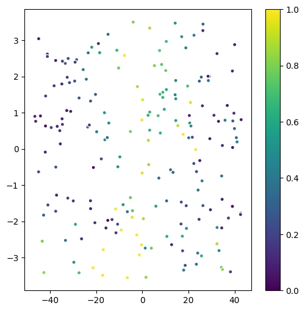

##### Predictive optimization

Median error (norm of difference between original parameters and predicted) is 3.94 on 1000 runs.

To check how good the prediction is I tried computing error for randomly generated parameters amd got median 5.15. So our solution is a little bit better.

#### Run 2
200 cylinders, each with 200 points uniformly distributed. Parameters - height and width are random floating in [0, 10). Noise - normal with standard deviation 0.1.

Number of neighbors = 4, C = 1e5 (C doesn't affect).

Takes 1h to execute. Median of relative error is  0.4.

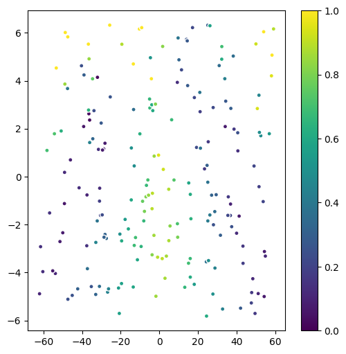

##### Predictive optimization

Median error is 4 on 1000 runs.

#### Run 3
200 cylinders, each with 200 points uniformly distributed along the surface (without up and bottom plane). Parameters - height and width are random floating in [0, 10). Noise - normal with standard deviation 0.1.

Number of neighbors = 3, C = 1e5.

Takes 1h 6m to execute. Median of relative error is  0.4.

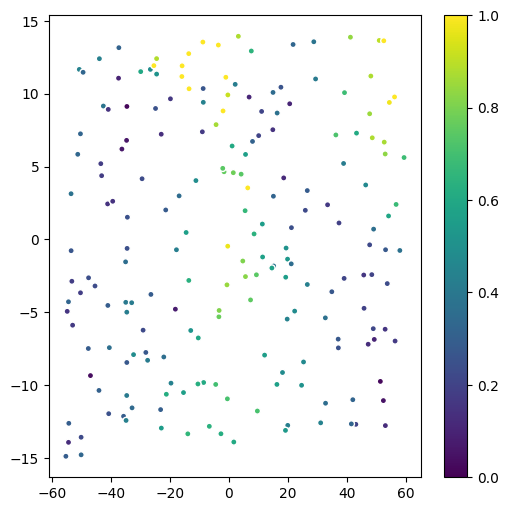

##### Predictive optimization

Median error is 3.53 on 1000 runs.

#### Run 4
200 cylinders, each with 200 points uniformly distributed along the surface (without up and bottom plane). Parameters - height and width are linspaces of size 200 with arguments `[1, 10]`. Noise - normal with standard deviation 0.05.

Number of neighbors = 3, C = 1e5.

Takes 1h 2m to execute. Median of relative error is  0.4.

##### Predictive optimization

Median error is 3.97 on 1000 runs.

#### Run 5
200 cylinders, each with 200 points uniformly distributed along the surface (without up and bottom plane). Parameters - height and width are linspaces of size 200 with arguments `[1, 10]`. Noise - normal with standard deviation 0.05.

Number of neighbors = 2, C = 1e7.

Takes 40 s to execute. Median of relative error is  0.37.

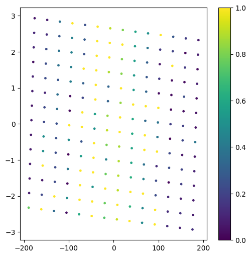

##### Predictive optimization

Median error is 3.12 on 1000 runs.

#### Run 6
200 cylinders, each with 200 points uniformly distributed along the surface (without up and bottom plane). Parameters - height and width are linspaces of size 200 with arguments `[1, 10]`. Noise - normal with standard deviation 0.05.

Number of neighbors = 2, C = 1e5.

Takes 1h 1m to execute. Median of relative error is  0.32.

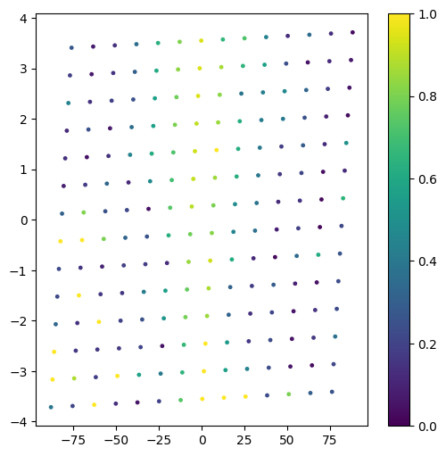

##### Predictive optimization

Median error is 3.07 on 1000 runs.

#### Run 7
200 cylinders, each with 200 points uniformly distributed along the surface (without up and bottom plane). Parameters - height and width are linspaces of size 200 with arguments `[1, 10]`. Noise - normal with standard deviation 0.05.

Number of neighbors = 2, C = 1e4.

Takes 25m to execute. Median of relative error is  0.36.

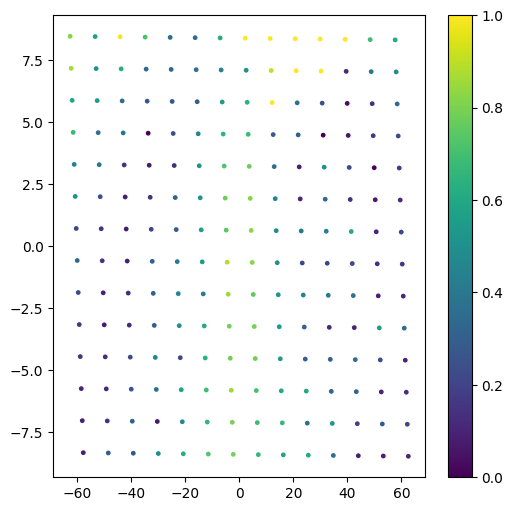

##### Predictive optimization

Median error is 3.84 on 1000 runs.

#### Run 8
200 cylinders, each with 200 points uniformly distributed along the surface (without up and bottom plane). Parameters - height and width are linspaces of size 200 with arguments `[1, 10]`. Noise - normal with standard deviation 0.05.

Number of neighbors = 2, C = 1e3.

Takes 54m to execute. Median of relative error is  0.18.

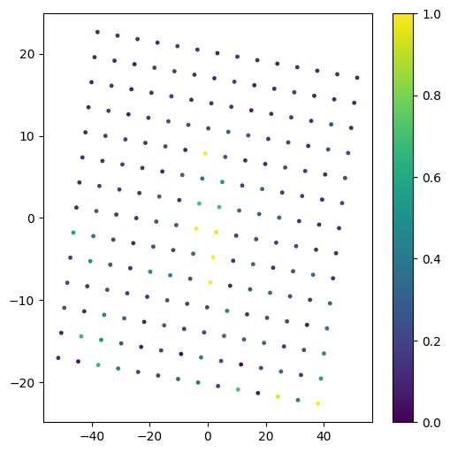

##### Predictive optimization

Median error is 2.59 on 1000 runs.

#### Run 9
200 cylinders, each with 200 points uniformly distributed along the surface (without up and bottom plane). Parameters - height and width are linspaces of size 200 with arguments `[1, 10]`. Noise - normal with standard deviation 0.05.

Number of neighbors = 2, C = 500.

Takes 8m to execute. Median of relative error is  0.07.

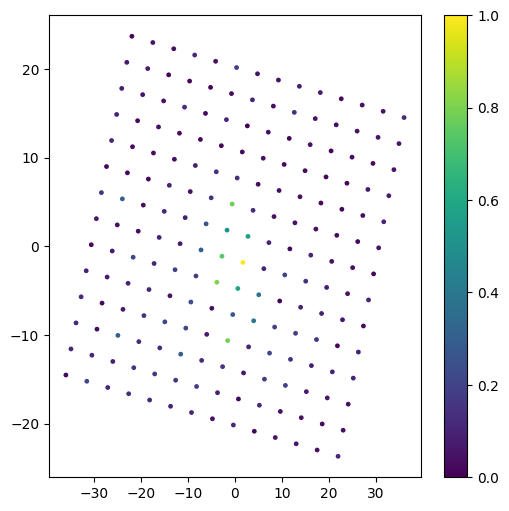

##### Predictive optimization

Median error is 2.3 on 1000 runs.

#### Run 10
200 cylinders, each with 200 points uniformly distributed along the surface (without up and bottom plane). Parameters - height and width are linspaces of size 200 with arguments `[1, 10]`. Noise - normal with standard deviation 0.05.

Number of neighbors = 3, C = 500.

Takes 32m to execute. Median of relative error is  0.15.

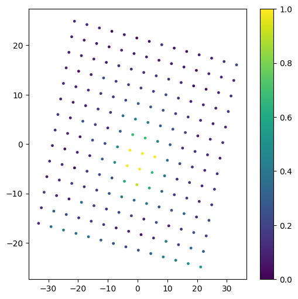

##### Predictive optimization

Median error is 2.93 on 1000 runs.

#### Run 11
200 cylinders, each with 200 points uniformly distributed along the surface (without up and bottom plane). Parameters - height and width are linspaces of size 200 with arguments `[1, 10]`. Noise - normal with standard deviation 0.05.

Number of neighbors = 2, C = 300.

Takes 40s to execute. Median of relative error is  0.07.

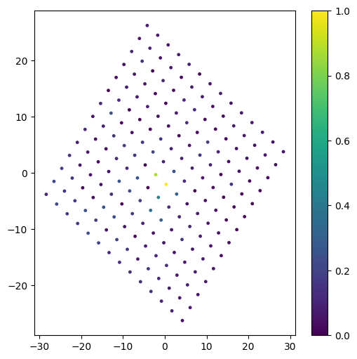

##### Predictive optimization

Median error is 2.39 on 1000 runs.

#### Run 12
200 cylinders, each with 200 points uniformly distributed along the surface (without up and bottom plane). Parameters - height and width are linspaces of size 200 with arguments `[1, 10]`. Noise - normal with standard deviation 0.05.

Number of neighbors = 2, C = 400.

Takes 1m 40s to execute. Median of relative error is  0.06.

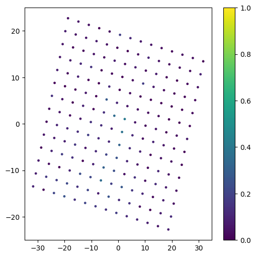

##### Predictive optimization

Median error is 2.59 on 1000 runs.
