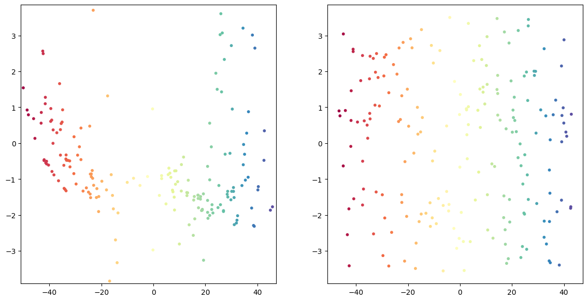
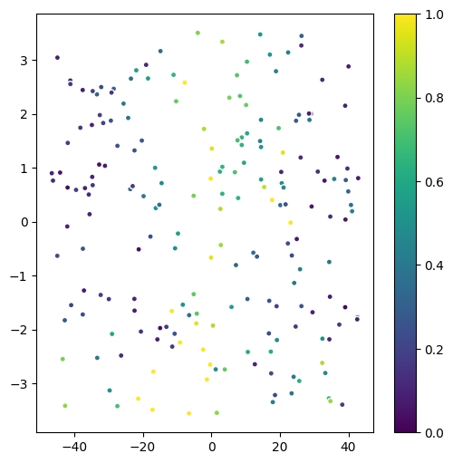

# manifold-learning

### Cylinder description

300 cylinders, each with 100 points uniformly distributed along the surface (without up and bottom plane). Parameters - height and width are random floating in [0, 10). Without noice.

Number of neighbors = 4, C = 1e5.

Takes 1h 16 min to execute. Median of relative error is  0.36.

Graphs are same as in the article.
Left shows embedded Y's got by semidefinite programming solution.
Right shows Y's generated from x by applying Y = xB, where B was obtained by least square method using Y's from the previous step.

This is an error plot - each point reflects relative error in it.

#### Predictive optimization

Median error (norm of difference between original parameters and predicted) is 3.94 on 1000 runs.

To check how good the prediction is I tried computing error for randomly generated parameters amd got median 5.15. So our solution is a little bit better.

