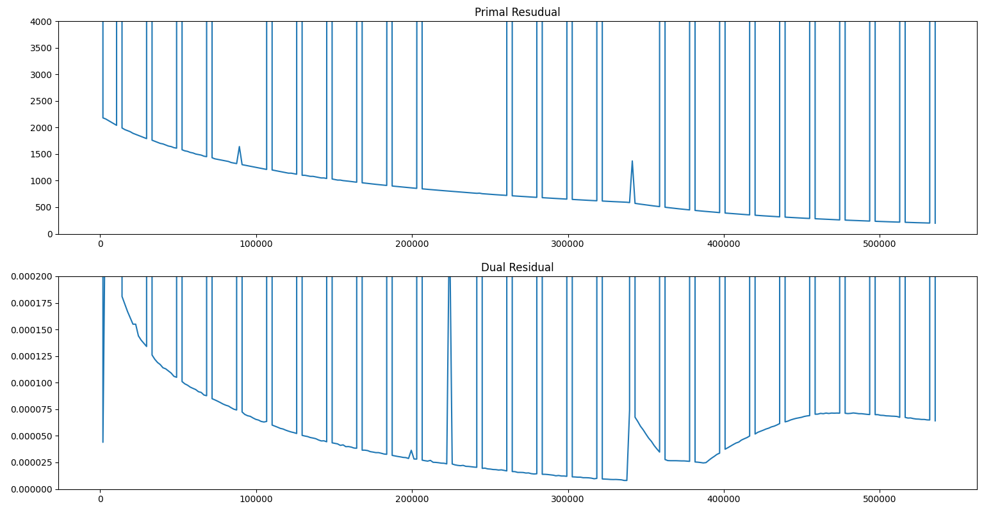
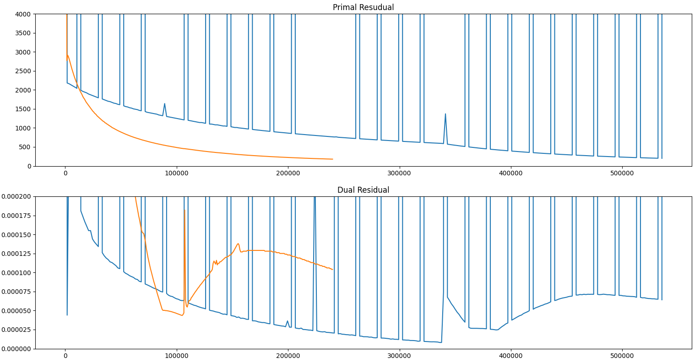

## General algorithm

We use SCS(splitting conic solver) to find solutions for SDP(Semidefinite programming) optimization problem. SCS algorithm builds a sequence that converges to the optimal solution. However, the speed of the convergence depends on a number of factors and solver options. SCS terminates when it has found a solution for with primal residual, dual residual and duality gap are all below a certain tolerance.

## Options of the solver

### Acceleration

By default, Anderson acceleration(AA) is enabled to speedup convergence. The main idea to take the variables from several previous iterations and combine them linearly in order to have better approximation of the solution. However, while experimenting with swissroll dataset I found that the acceleration doesn't help us and only slowing down the convergence.

On the graph above we can see that the residuals do not decrease consistently, but sometimes their values become large. This is the effect that Anderson acceleration has in our case and disabling acceleration decreases the time solver takes to solve to problem.

So I recommend trying disabling it and compare the number of iterations that was taken to reach good-enough solution. It can be done by setting `acceleration_lookback` to `0`.

### Scale

`scale` is used to control the balance between minimizing primal and dual residual. By default, `scale` is adaptive and changes during the optimization. However, I observed that it doesn't work perfectly and sometimes you can manually choose more optimal value for this parameter. This gave me 2-3 times faster convergence to the optimal enough solution. Here is the comparison:

Blue graph is for the solution with AA and adaptive scale enabled. Orange represent the solution without AA and manually set scale options: `adaptive_scale=False, scale=25e-5`.
